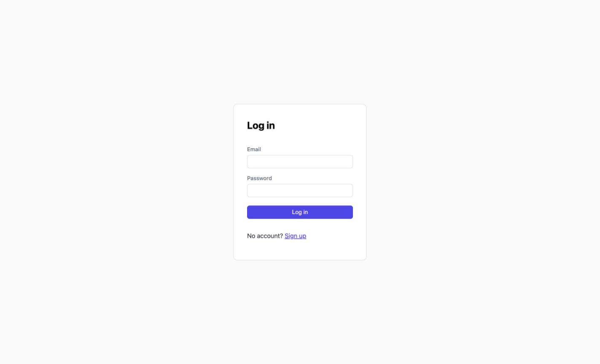
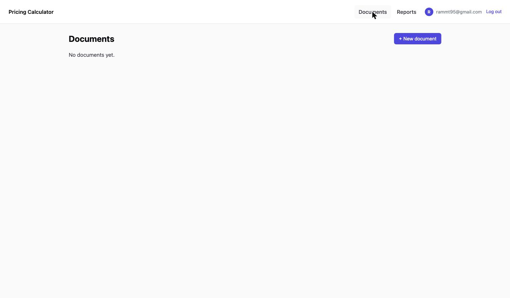
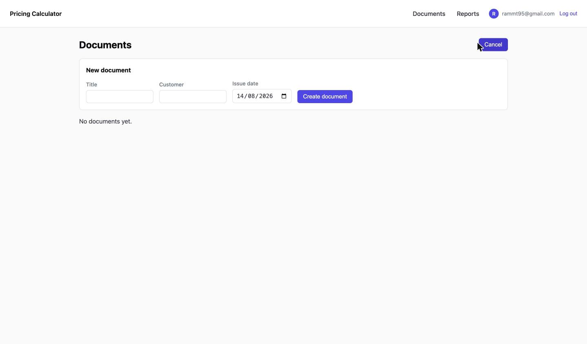
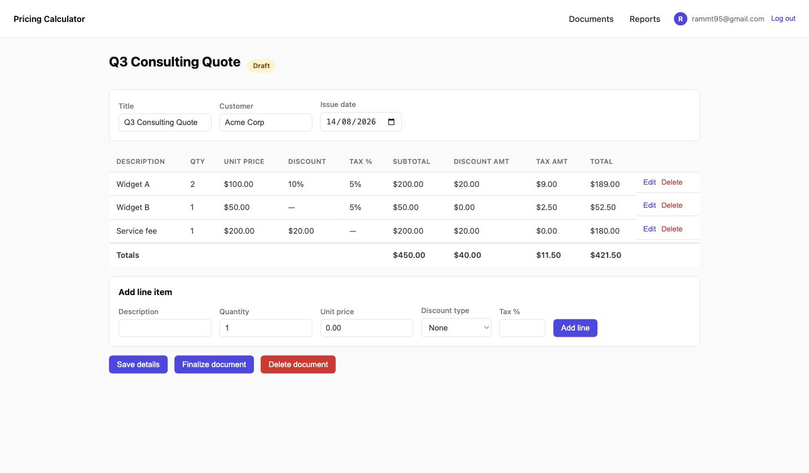
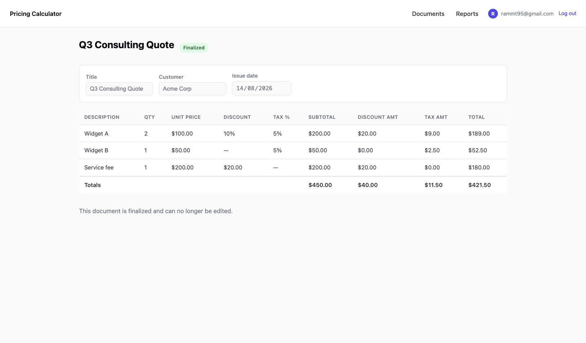
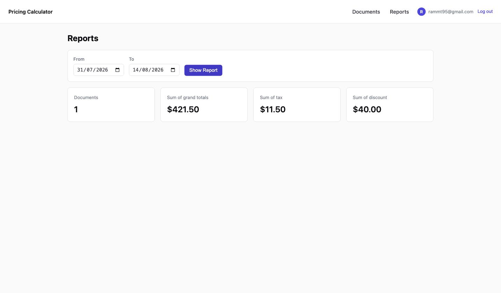

# Multi-Rate Pricing Calculator

A small web app for creating quote/invoice-style **documents** with line items, applying
per-line discounts and tax, computing totals server-side, and finalizing documents into
an immutable state. Built with **Django + Django REST Framework** (API) and a **React +
Vite + TypeScript** SPA (frontend), talking over a JWT-authenticated REST API.

**Live**: https://pricing-calculator-frontend-krfc.onrender.com — see [Deployment](#deployment)
for the note on first-load speed before you click through.

**Problem statement**: [docs/problem-statement.pdf](docs/problem-statement.pdf) — the
original assignment this repo implements, included as-given for reference.

## Screenshots

Happy path, captured against the live deployment (not local dev):

| | |
|---|---|
|  Login |  Documents (empty state, new-document form collapsed) |
|  New document form |  Line items entered — grand total matches the assignment's sample exactly |
|  Finalized (read-only) |  Reports |

## Stack

- **Backend**: Django 6, Django REST Framework, `djangorestframework-simplejwt` (JWT auth),
  SQLite (dev) / Postgres (prod, via `DATABASE_URL`).
- **Frontend**: React 19, Vite, TypeScript, React Router.
- **Tests**: `pytest` + `pytest-django`, focused on the calculation module.

## Project structure

```
backend/
  config/           settings, urls
  accounts/         custom email-based User model, register + JWT endpoints
    throttles.py     AuthRateThrottle — rate limit on register/login
  documents/
    models.py        Document, LineItem
    calculations.py  pure calc module (no DB/HTTP dependency) — the core of this assignment
    exceptions.py     assert_draft() — the single immutability guard every mutating endpoint calls
    serializers.py    validation + document_to_dict() (single source of computed totals)
    views.py          REST endpoints
    test_calculations.py, test_lifecycle.py, test_duplicate.py, conftest.py
frontend/
  src/
    api/            fetch client (JWT + refresh), typed API calls
    pages/          Login, Signup, Documents, DocumentDetail, DocumentPrint, Reports
    components/     Layout, ProtectedRoute
```

## Prerequisites & setup

### Backend

```bash
cd backend
python3 -m venv .venv
source .venv/bin/activate
pip install -r requirements.txt
cp .env.example .env
python manage.py migrate
python manage.py runserver 8000
```

Optional, for `/admin/`:
```bash
python manage.py createsuperuser
```

Run the test suite (the calculation module's unit tests are the primary deliverable):
```bash
pytest
```

### Frontend

```bash
cd frontend
npm install
cp .env.example .env   # VITE_API_BASE_URL defaults to http://127.0.0.1:8000/api
npm run dev
```

Open `http://localhost:5173`. Sign up, then create a document.

## Calculation & rounding policy

All totals are computed **server-side only**, in `documents/calculations.py` (a pure,
Django-free module) using Python's `Decimal` — never floats — so there's no drift.

**Rounding policy: round to the nearest cent (`ROUND_HALF_UP`) after every derived step**,
not just once at the end. Concretely, per line:

1. `subtotal = round(quantity × unit_price, 2)`
2. Apply discount — fixed amount subtracted, or percent off the subtotal (never both):
   `discount_amount = round(discount, 2)`
3. `after_discount = subtotal − discount_amount`
4. Tax is applied **on the discounted amount**, not the original subtotal:
   `tax_amount = round(after_discount × tax_percent / 100, 2)`
5. `line_total = after_discount + tax_amount`

Document totals are the sum of each line's subtotal / discount / tax / total.

### Worked example (from the assignment spec, verified in `test_calculations.py`)

| Line | Qty | Unit price | Discount | Tax | Subtotal | Discount amt | After discount | Tax amt | Total |
|---|---|---|---|---|---|---|---|---|---|
| Widget A | 2 | 100.00 | 10% | 5% | 200.00 | 20.00 | 180.00 | 9.00 | 189.00 |
| Widget B | 1 | 50.00 | — | 5% | 50.00 | 0.00 | 50.00 | 2.50 | 52.50 |
| Service fee | 1 | 200.00 | $20 fixed | — | 200.00 | 20.00 | 180.00 | 0.00 | 180.00 |

**Document totals**: subtotal $450.00, total discount $40.00, total tax $11.50, **grand total $421.50**.

This exact scenario is exercised end-to-end in `documents/test_calculations.py::test_assignment_sample_document`.

### Other calculation decisions

- **Fixed discount exceeding the line subtotal is rejected** (400 error), not clamped —
  chose "reject" because silently clamping could hide a data-entry mistake (e.g. a
  misplaced decimal) that the user would want to know about.
- A line takes a **percent or fixed** discount, never both — enforced by a single
  `discount_type` field.
- `ROUND_HALF_UP` was chosen explicitly over Python's default banker's rounding
  (`ROUND_HALF_EVEN`), since it matches how most people expect "$X.XX5" to round and is
  what invoicing/accounting tools conventionally use.

## Finalize / immutability rules

- A document starts as `draft`: fully editable (title, customer, issue date, and all
  line items).
- `POST /api/documents/<id>/finalize/` flips it to `finalized`. This is rejected with
  `400` if the document has no line items yet.
- Once `finalized`, **any** edit attempt — updating document metadata, adding/editing/
  deleting a line item, or deleting the document itself — is rejected with **`409
  Conflict`** and a clear message. This is enforced in one place: `documents/exceptions.py::assert_draft()`,
  called from every mutating endpoint, so the rule can't drift between endpoints.
- Deleting a document is only allowed while it's a draft — finalized documents are kept
  as an immutable record, same as the line items inside them.
- Duplicating a finalized document into a new draft is supported — see **Stretch
  goals** below.

## Stretch goals

All three from the spec are done:

1. **Duplicate a finalized document into a new draft** — `POST
   /api/documents/<id>/duplicate/` copies the header fields and every line item into a
   brand-new `draft` document; the source is untouched. Only works on a finalized
   source (`400` if you try it on a draft — a draft is already editable, so there's
   nothing to duplicate it for). `documents/test_duplicate.py` covers it (copy is
   independent/editable, source untouched, draft source rejected).
2. **Reject finalize if any line has quantity ≤ 0 or negative prices** — satisfied by
   construction rather than a check at finalize time: `MinValueValidator` on the model
   fields (`documents/models.py`) makes it impossible to save such a line in the first
   place, draft or otherwise, so finalize can never encounter one. Locked in by
   `documents/test_lifecycle.py::TestQuantityAndPriceValidation`.
3. **Printable view** — `/documents/:id/print` (`frontend/src/pages/DocumentPrint.tsx`),
   a clean read-only layout with a "Print / Save as PDF" button that uses the browser's
   native print dialog. `@media print` CSS hides the toolbar/back-link so only the
   document itself prints. No new backend dependency (no PDF-rendering library) — see
   "what I'd improve" for the tradeoff.

## Auth

Email + password, via a custom Django `User` model (`accounts.User`, `USERNAME_FIELD =
"email"`). `djangorestframework-simplejwt` issues short-lived access tokens (1h) and
refresh tokens (7d):

- `POST /api/auth/register/` — create account, returns a token pair
- `POST /api/auth/token/` — log in, returns a token pair
- `POST /api/auth/token/refresh/` — exchange a refresh token for a new access token
- `GET /api/auth/me/` — the current user's `{id, email}`, from the access token. The
  frontend's navbar profile indicator (email + avatar) calls this on mount rather than
  trusting only what was cached in `localStorage` at login time — so it still shows the
  right identity for a session that started before that indicator existed, or after a
  page reload.

Every document/line-item endpoint is scoped to `request.user` — a user can never see or
modify another user's documents (enforced via `.filter(owner=request.user)` in every
queryset, not just at the UI layer).

**Tradeoff**: the frontend stores tokens in `localStorage` and refreshes on a 401, rather
than an httpOnly cookie. Simpler to wire up for a same-time-box SPA + separate-API
setup, but more vulnerable to XSS than a cookie-based session — noted under "what I'd
improve."

## API overview

| Method | Path | Notes |
|---|---|---|
| POST | `/api/auth/register/`, `/api/auth/token/`, `/api/auth/token/refresh/` | |
| GET | `/api/auth/me/` | current user's `{id, email}` |
| GET/POST | `/api/documents/` | list / create |
| GET/PATCH/DELETE | `/api/documents/<id>/` | PATCH/DELETE blocked (409) once finalized |
| POST | `/api/documents/<id>/finalize/` | |
| POST | `/api/documents/<id>/duplicate/` | finalized only; copies header + all lines into a new draft (stretch goal) |
| GET/POST | `/api/documents/<id>/lines/` | |
| PATCH/DELETE | `/api/documents/<id>/lines/<line_id>/` | blocked (409) once finalized |
| GET | `/api/reports/summary/?date_from=&date_to=` | count, sum of grand total / tax / discount over `issue_date` range |

## Assumptions & tradeoffs

- Line item **totals are never stored** — `document_to_dict()` in `documents/serializers.py`
  recomputes them from the raw inputs (quantity, unit price, discount, tax) on every read,
  via the same calc module used everywhere else. This guarantees the API can never return
  a total that disagrees with the calc logic, at the cost of recomputing on every request.
  At real scale, I'd materialize totals on `finalize` (drafts still recompute live) and
  cache them for the report, since draft documents are the only ones that still change.
- Quantity accepts decimals (e.g. `2.5` hours), not just integers — the spec only requires
  "≥ 1", which doesn't preclude fractional values.
- `discount_value` is required and validated against its `discount_type` (0–100 for
  percent, ≥ 0 for fixed) at the serializer layer; `tax_percent` must be 0–100 if present.
- The reports endpoint filters and sums in Python after fetching each document's lines —
  fine at this scale (a take-home dataset); would move to a DB-level aggregate query (or
  the cached-totals approach above) before this saw real traffic.
- CORS is restricted to `CORS_ALLOWED_ORIGINS` (defaults to the local Vite dev server);
  set it to the deployed frontend origin in production.

## What I'd improve before production

1. **httpOnly cookie session** instead of `localStorage` JWTs, to remove the XSS exposure.
2. **Materialize + cache document totals on finalize** so the report endpoint doesn't
   recompute the calc module over every document in range on every request.
3. **Token blacklisting on logout** (simplejwt supports this via its blacklist app) —
   currently logout is client-side only; a stolen refresh token stays valid until it expires.
4. **Optimistic UI / row-level saving** on the line item table instead of a single
   add/edit form — faster to use with many line items.
5. A real **PDF generation** service (e.g. WeasyPrint) instead of relying on the
   browser's print-to-PDF for the printable view — more control over pagination and
   layout for longer documents.

## Security

What's enforced today:
- **HTTPS everywhere** in production (Render terminates TLS on both services); Django is
  told to trust the proxy's `X-Forwarded-Proto` header so it correctly recognizes those
  requests as secure.
- **Rate limiting** via DRF throttling — `20/min` for anonymous requests, `120/min` per
  authenticated user, and a tight `5/min` specifically on `/api/auth/register/` and
  `/api/auth/token/` (`accounts/throttles.py::AuthRateThrottle`) to slow down
  credential-stuffing/brute-force against login and signup.
- **Auth-gating + per-user scoping** on every document/line endpoint (`IsAuthenticated`
  by default, every queryset filtered to `request.user`).
- **CORS allowlist** (`CORS_ALLOWED_ORIGINS`), not a wildcard.
- Production-only cookie/HSTS hardening (`SESSION_COOKIE_SECURE`, `CSRF_COOKIE_SECURE`,
  `SECURE_HSTS_SECONDS`), gated on `DEBUG=False` so local dev over plain HTTP still works.

Known gaps (JWT in `localStorage`, no token blacklist) are listed under **What I'd
improve** below — this is take-home-scoped, not a claim of full production hardening.

## Deployment

**Stack**: [Render](https://render.com) hosts all three pieces — the Django API (web
service), the React build (static site), and Postgres — via the `render.yaml` Blueprint
at the repo root, so provisioning is one click instead of configuring three resources by
hand. No separate DB provider needed.

### Steps

1. Push this repo to GitHub (public).
2. On [render.com](https://render.com) (free, no card required): **New → Blueprint** →
   select the repo. Render reads `render.yaml` and provisions the database, the backend
   web service, and the frontend static site together.
3. On the backend service's **Environment** tab, set `SECRET_KEY` — generate one locally
   with:
   ```bash
   python -c "import secrets; print(secrets.token_urlsafe(50))"
   ```
   `DATABASE_URL` is filled in automatically (the Blueprint wires it from the Postgres
   instance via `fromDatabase` — nothing to copy by hand).
4. Once the backend finishes its first deploy, copy its URL (`https://pricing-calculator-api-....onrender.com`)
   and set `VITE_API_BASE_URL` on the frontend static site to `<that URL>/api` — this
   triggers a rebuild (Vite bakes the value in at build time, not runtime).
5. Once the frontend finishes deploying, copy *its* URL and set it as
   `CORS_ALLOWED_ORIGINS` on the backend — triggers a redeploy.
6. Open the frontend URL.

No `.env` file exists on Render — values are set in its dashboard (or declared in
`render.yaml`) and injected as real process env vars, which `settings.py`'s
`os.environ.get(...)` calls read the same way regardless of source.

### Known limitations (free tier)

- **Cold starts**: both services sleep after ~15 min idle; the first request after that
  takes 30–60s to wake up (a blank/loading screen, not a broken app).
- **Postgres expiry**: the free database expires 30 days after creation (14-day grace
  period after). Recreate it (same Blueprint auto-rewires `DATABASE_URL`) or upgrade
  (~$7/mo) if it needs to stay up longer than a review window.

**Live URL**: https://pricing-calculator-frontend-krfc.onrender.com
(API: https://pricing-calculator-api.onrender.com/api)

Verified end-to-end against the live instance: sign up, create a document, add the
assignment's 3 sample lines, grand total shows $421.50, finalize, confirm an edit is
rejected, reports page matches. Screenshots above.
